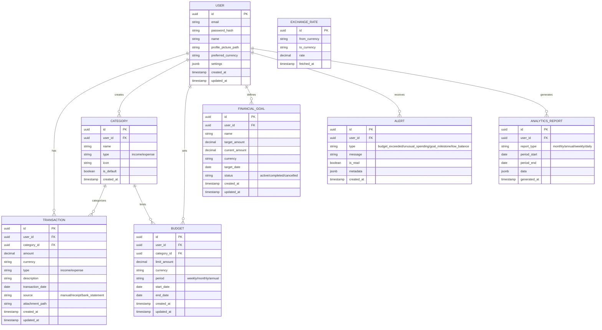
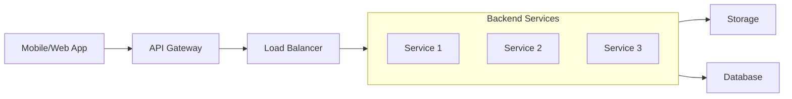
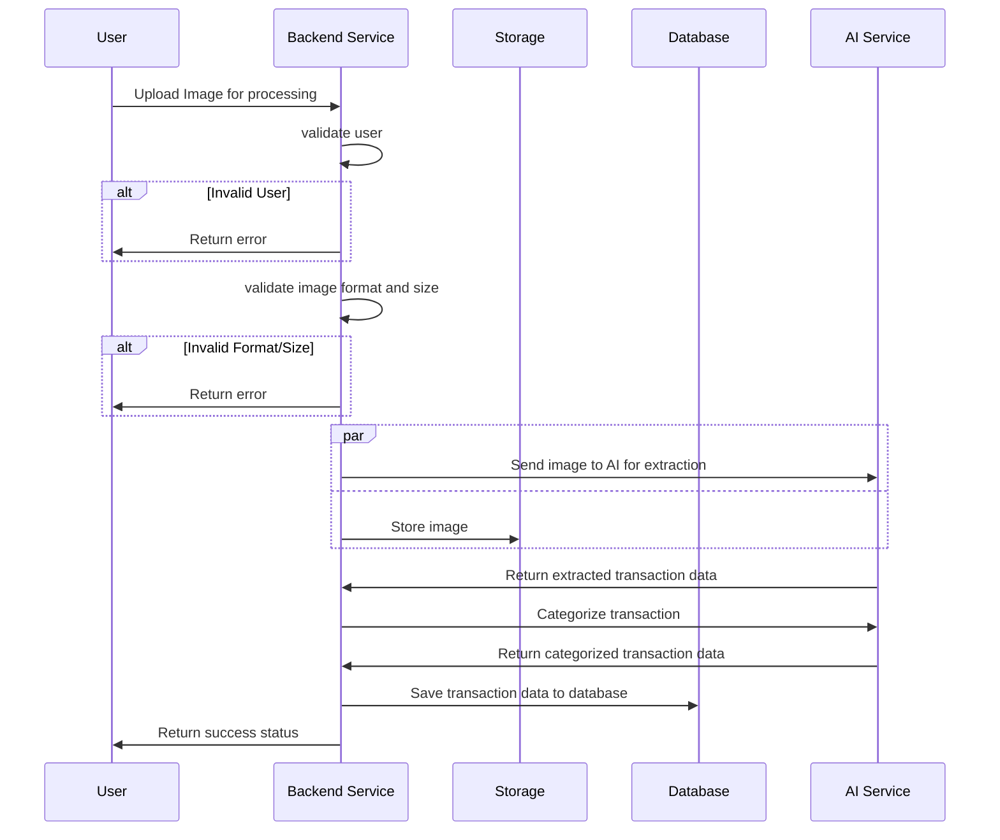
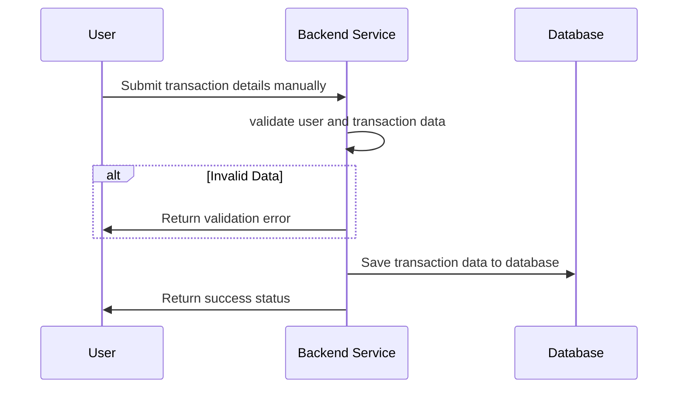
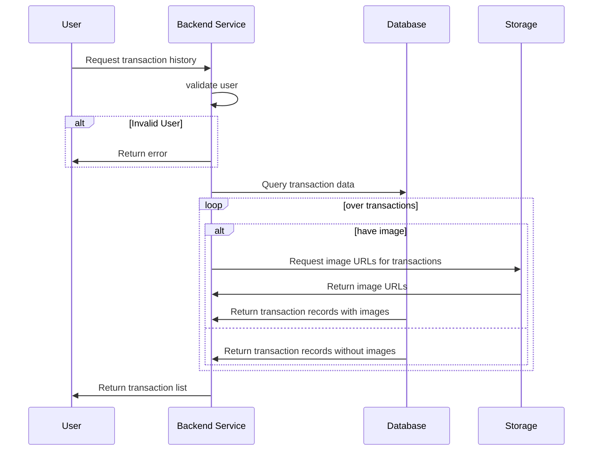
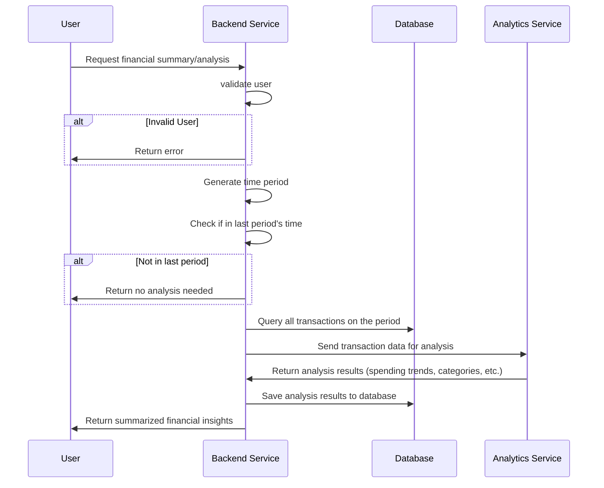
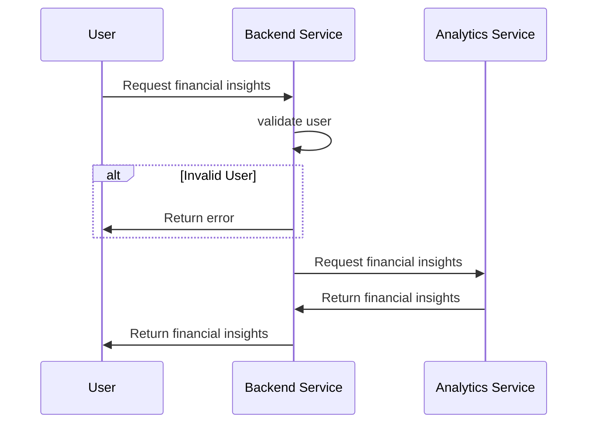

**Ficet (Financial Pocket)**

## Requirements

### Functional requirements

- Track personal expenses and income
- Be able to extract data transactions from bank statements or receipts
- Categorize transactions (food, transport, entertainment, etc.)
- Generate monthly/annual financial reports
- Summarize, analyze, and visualize financial data including health metrics, spending predictions, spending insights, spending trends, and goal tracking
- Allow users to set financial goals and track progress
- Provide alerts for unusual spending or budget overruns
- Support multiple currencies and exchange rate tracking
- Set budget limits for categories
- Offline capability for basic lightweight operations (e.g., adding transactions and viewing reports) excluding data extraction features

### Non-functional requirements

- Low latency for real-time transaction processing
- High availability and fault tolerance
- Data encryption for sensitive financial information
- Regular automated backups for data recovery

## Capacity Planning

### Storage

- User metadata (profiles, preferences, settings) - ~1KB per user x 500k = ~500MB total

- User transaction data (historical records, categorizations, notes) - estimated 500 transactions per month ~1KB per transaction × 500 × 12 months × 500k users = 6,000,000KB = 6GB per year

- User profile pictures and attachments - estimated 100MB per user × 500k users = 50TB total per month

- Daily bandwidth:
  - each receipt/bank statement picture: 3MB; each user submits 10 pictures; 500k users × 10 × 3MB = 15,000,000MB = 15TB per day
  - Total daily bandwidth: ~15TB

## Architecture

### Storage Design

This system will use blob storage to store all user pictures and attachments.
- User pictures and attachments are immutable and stored without versioning
- All files are stored with this path pattern: `users/{userId}/{attachmentType}/{filename}`

### Relational Database

### High level

### System Workflow

#### Submit Transaction from Picture

#### Submit Transaction from Manual Entry

#### Fetch Transactions

#### Summarize, analyze, and visualize periodic transactions
> **_NOTE_**: This workflow processes transactions and categorizes them over time periods e.g weekly, monthly, and annually and only runs on the last period's time.

> **_TODO_**: This workflow can be improved to support real-time updates and more sophisticated analytics.

#### Fetch Financial Insights

