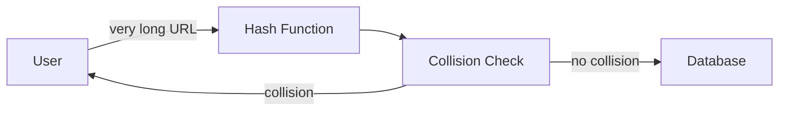
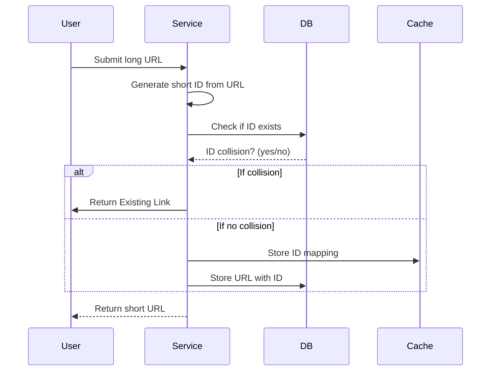
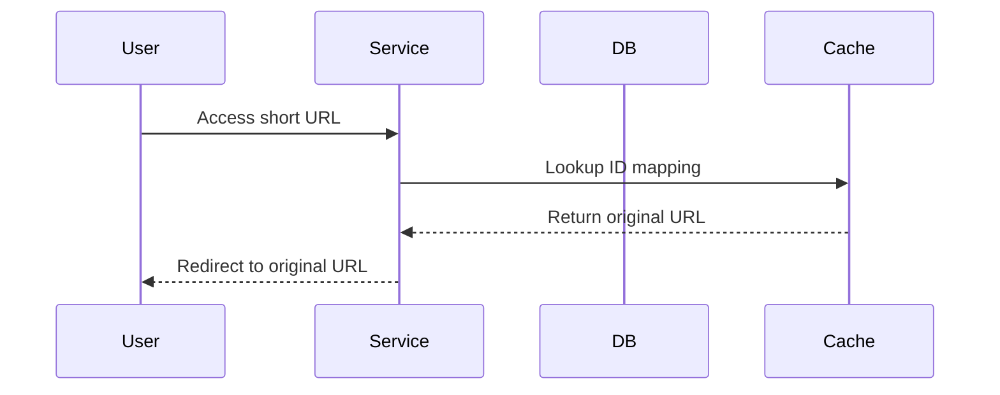

**Distributed Deterministic Shorten URL Service**

## Requirements

### Functional requirements
- Given a long URL, the service should generate a shorter and unique alias for it (with maximum 6 characters).
- When the user hits a short link, the service should redirect to the original link.
- Links will expire after a standard default time span.

### Non-Functional requirements
- The system should be highly available. This is really important to consider because if the service goes down, all the URL redirection will start failing.
- URL redirection should happen in real-time with minimal latency.

## Capacity Planning

Assuming that service will be receive 30 million new request per month and  all links will be keep for 5 years.

### Data Modelling

this service will save this attributes for each short link:
- id (short link identifier)  [6 ascii characters]
- url (original url) [2000 ascii characters] [1] 
- created_at (unix timestamp) 
- expires_at (unix timestamp)

for each row we will use:
- 6 bytes (6 * 1 bytes) for id
- 2000 bytes (2000 * 1 bytes) for url
- 8 bytes (8 bytes) for created_at
- 8 bytes (8 bytes) for expires_at

with total = 2022 bytes for each short link

### Data Capacity Planning

With 30 million new request per month, annually we will have 360 million new request multiplied by 2022 bytes for each short link =  727920000000 bytes per year for storage per year = 3639600000000 bytes for 5 years which equal to 3.3101969166 TB (terabytes).

## Design 

### Low level Logic

Id must be predictable to avoid collisions and ensure consistent mapping across all instances by using a deterministic hash function based on the input URL.

Using this approach can lower architecture complexity and ensure that the same URL always produces the same short link across different service instances.

### Sequence Diagram

#### High Level Access Flow

##### Insert Flow

##### Get Flow

### Infrastructure Architecture

```mermaid
architecture-beta
    group region1(cloud)[Region 1]
    group region2(cloud)[Region 2]

    service lb(logos:aws-elb)[Load Balancer]

    group api1(logos:aws-api-gateway)[API] in region1
    service db1(logos:aws-aurora)[Database] in api1
    service server1(logos:aws-lambda)[Server] in api1

    group api2(logos:aws-api-gateway)[API] in region2
    service db2(logos:aws-aurora)[Database] in api2
    service server2(logos:aws-lambda)[Server] in api2

    lb:B -- T:server1
    lb:B -- T:server2
    db1:T -- B:server1
    db2:T -- B:server2
    db1:R -- L:db2
```

Reference:

[1] https://stackoverflow.com/questions/417142/what-is-the-maximum-length-of-a-url-in-different-browsers